## Question 1 - Behaviour of the lookup implementations

The goal of this part was to see what happens when the value used to access a lookup table becomes invalid at runtime.

The lookup table is:

`{10, 20, 30, 40, 50, 60, 70, 80}`

and the index is calculated with:

`index = sensor_value - 1`

This means that a sensor value of `1` gives index `0`, while a sensor value of `0` gives index `-1`, which is invalid.

The application provides four lookup implementations:

| Argument | Implementation | Idea |
|---|---|---|
| `0` | `lookup_c_assert` | use an assertion |
| `1` | `lookup_c_safe` | clamp the index |
| `2` | `lookup_cpp` | use `std::array::at()` |
| `3` | `LookUpTable` | check the index and return a fail-safe value |

I tested them with three different builds: production, debug and sanitized.

### Production build

#### `lookup_c_assert`

With a valid value, everything works normally:

`inc 0` gives `1 -> 10`.

When the sensor value becomes `0`, the calculated index is `-1`. Since assertions are disabled in the production build, the invalid array access still happens.

In my case I got values such as `80` and `70`, but these values are not reliable because this is undefined behaviour.

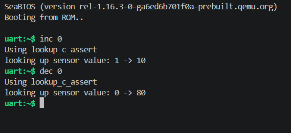

This shows that assertions should not be the only protection against invalid runtime input.

#### `lookup_c_safe`

This version checks the index and clamps it to a valid range.

Even when the sensor value becomes `0` or `-1`, the function still returns `10`.

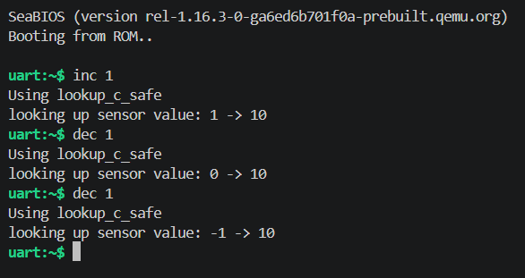

This is safe because there is no invalid array access. The disadvantage is that the invalid input is hidden because it is converted into a valid result.

#### `lookup_cpp`

This version uses `std::array::at()`.

A valid access works normally, but when the index becomes invalid, the application calls `abort()`.

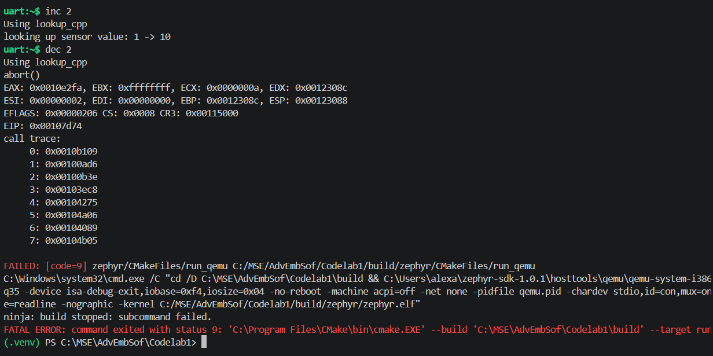

This is safer than directly accessing an invalid index, but the whole application stops.

#### `LookUpTable`

This implementation checks the index manually.

When the index is invalid, it returns the fail-safe value `-1` instead of accessing the array.

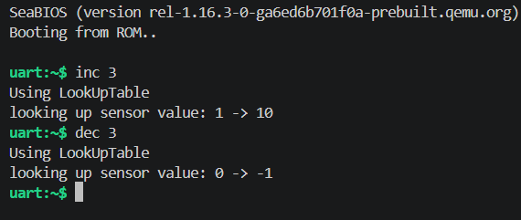

I think this is the most useful behaviour for an embedded application because the error is detected but the application can continue running.

### Debug build

The main difference in the debug build is that assertions are enabled.

#### `lookup_c_assert`

This time the invalid index is detected by the assertion:

`ASSERTION FAIL [idx >= 0 && idx < kLutSize]`

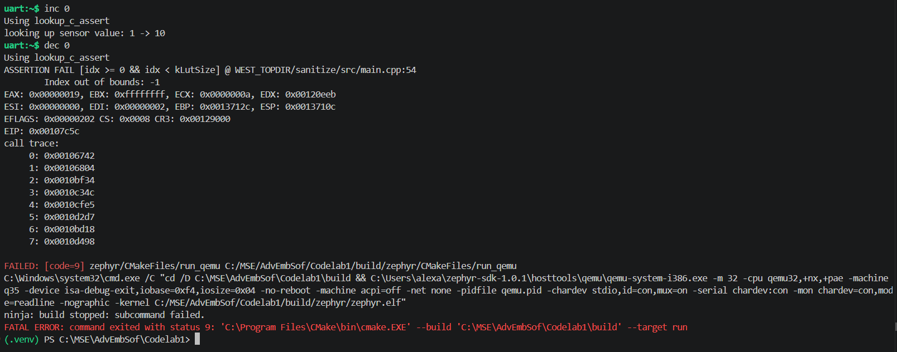

So the debug build catches the problem before the invalid array access happens.

#### `lookup_c_safe`

The behaviour is the same as in production: the invalid index is clamped and the result is `10`.

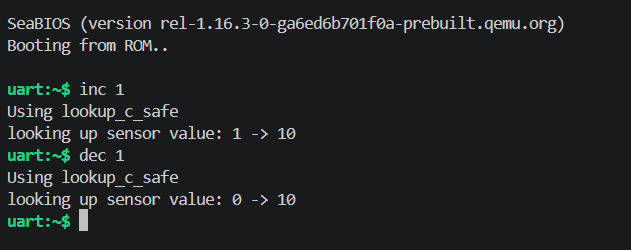

#### `lookup_cpp`

The invalid index is detected by `std::array::at()` and the application aborts.

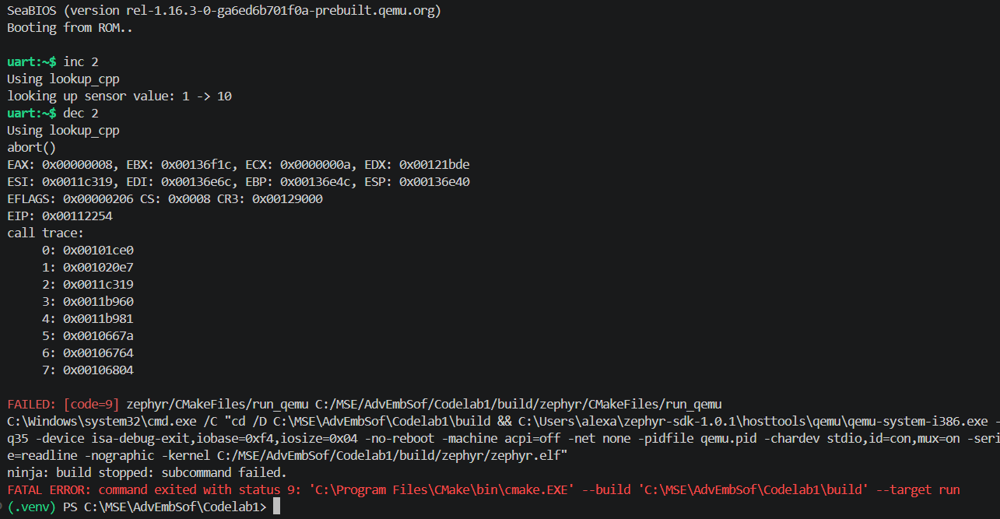

#### `LookUpTable`

The invalid index is detected and `-1` is returned.

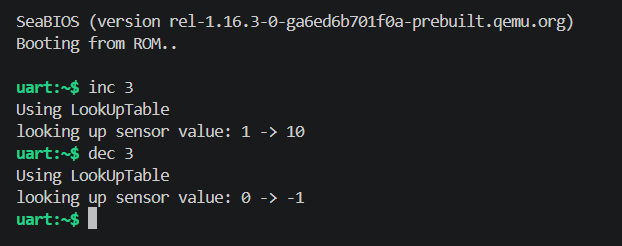

### Sanitized build

In the sanitized build, UBSan is enabled.

I made the sanitizer flags conditional on `CONFIG_UBSAN`, otherwise the production build was also getting sanitized.

#### `lookup_c_assert`

With an invalid index, UBSan detects the problem:

`UBSAN: ERROR out_of_bounds`

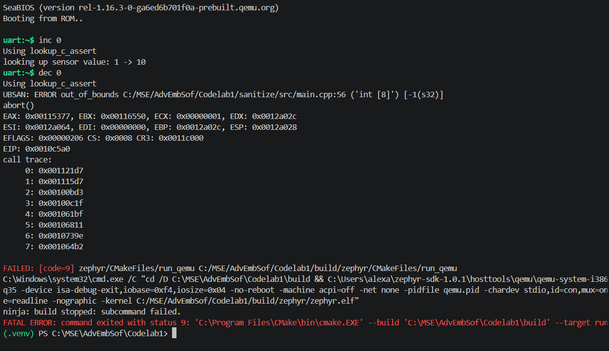

This is interesting because in production the same invalid access just returned a random-looking value.

#### `lookup_c_safe`

No UBSan error is produced because the invalid index is corrected before accessing the array.

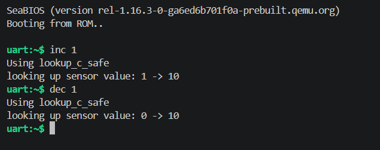

#### `lookup_cpp`

The application still aborts because `std::array::at()` detects the invalid access itself.

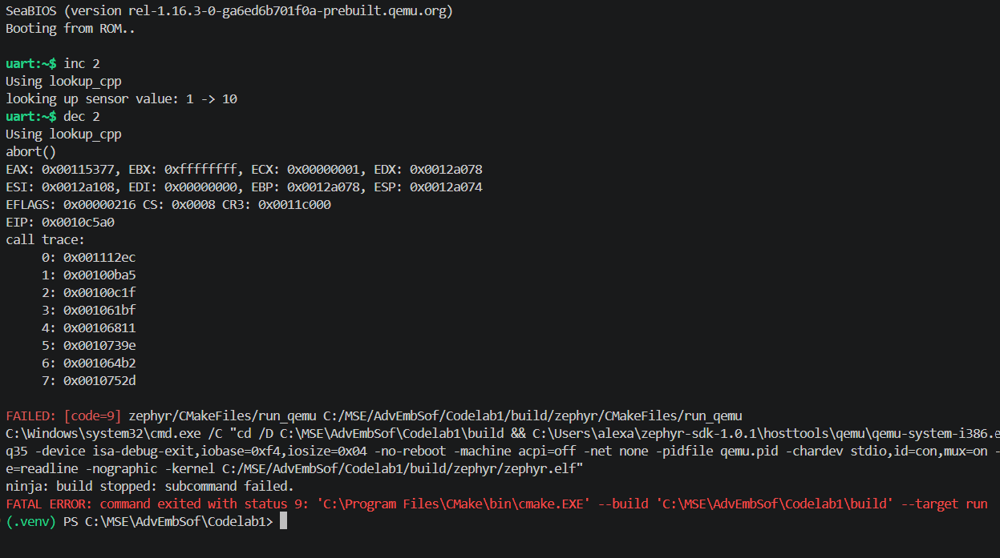

#### `LookUpTable`

The invalid index is detected manually and the function returns `-1`.

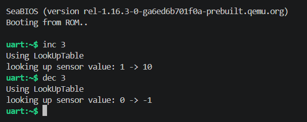

No sanitizer error is produced because no invalid access actually happens.

### Summary

| Implementation | Production | Debug | Sanitized |
|---|---|---|---|
| `lookup_c_assert` | undefined behaviour | assertion aborts | UBSan detects out-of-bounds |
| `lookup_c_safe` | clamps index | clamps index | clamps index |
| `lookup_cpp` | aborts | aborts | aborts |
| `LookUpTable` | returns `-1` | returns `-1` | returns `-1` |

From these tests, the main thing I learned is that assertions are useful during development, but they should not be used as the only runtime protection because they may be disabled in production.

`lookup_c_safe` avoids crashes, but it can hide the fact that the input was invalid.

`lookup_cpp` is safer than an unchecked array access because `at()` performs bounds checking, but it stops the application.

`LookUpTable` gives the most controlled behaviour because it detects the invalid value, returns an error value and keeps the application running.

## Additional runtime bug detected by UBSan

The exercise also asks for another bug that is not detected by `clang-tidy` but is detected at runtime by a sanitizer.

I added an `overflow` shell command which performs:

`result = value + 1`

The value comes from the shell, so `clang-tidy` cannot know which value will be entered at runtime.

I tested the application with:

`just run-clang-tidy sanitize debug+log+san`

and `clang-tidy` completed successfully.

Then I used the maximum signed 32-bit integer:

`overflow 2147483647`

Without the signed integer overflow sanitizer, the result wrapped around to:

`2147483647 + 1 = -2147483648`

To detect this case, I added:

`-fsanitize=signed-integer-overflow`

to the sanitized build.

After rebuilding, running the same command produced:

`UBSAN: ERROR add_overflow`

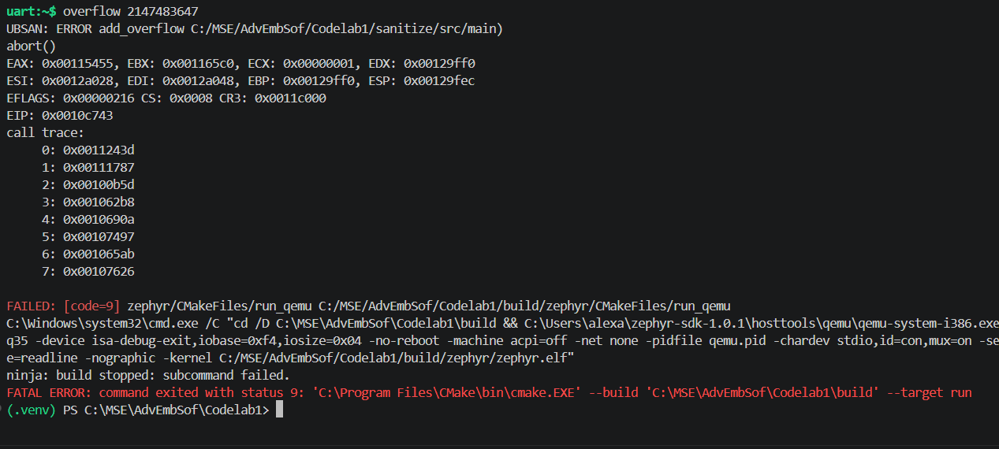

This shows the difference between static analysis and runtime sanitizers quite well.

`clang-tidy` checks the source code without running the program, so it cannot always know what values will be used at runtime.

UBSan checks the program while it is running, so it can detect errors such as the signed integer overflow when they actually happen.